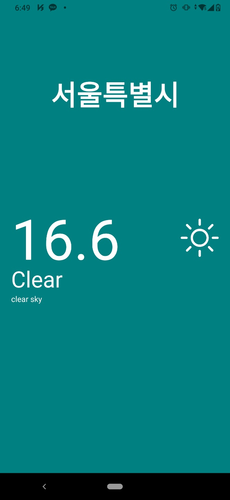
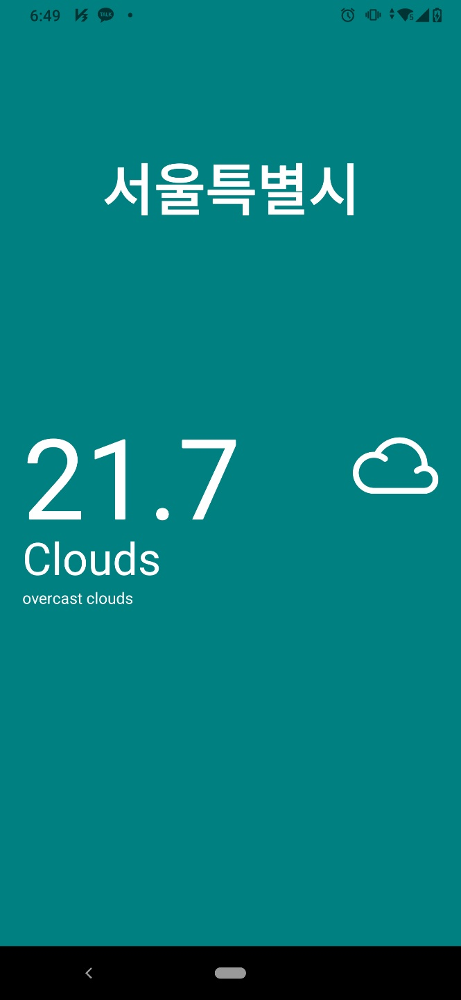

# ReactNative 날씨앱 만들기 
나의 첫번째 ReactNative앱 만들기 시작!
디자인 참고>>https://dribbble.com/shots/14717133-Weather-App-Concept   
OpenWeatherAPI 활용 주간날씨정보를 보여주는 날씨앱   




## 주요 학습내용
- 화면출력을 위한 태그들이 React.js와의 다른부분을 확인할 수 있었다.    
  div->View, img->image, input->TextInput, p,span,h1...->Text   
- @expo/vector-icons를 활용하여 아이콘 사용방법
- expo-location활용하여 사용자의 위치정보 확인방법
- styleSheet활용한 스타일 적용방법   
  stylesheet객체에스타일추가하기 {...styles.day,alignItems:"center"}
- dimensions활용한 사용자 모바일기기의 화면크기 확인방법
- paddingHorizontal,paddingVertical 등 CSS에는 없는 스타일속성 사용
- 스크롤 구현방법
- 로딩바 구현방법

### OpenWeatherApi URL
```
https://api.openweathermap.org/data/2.5/onecall?lat={latitude}&lon={longitude}&exclude=alerts&appid={API_KEY}
```
## React Native Packages
https://reactnative.dev/
- ActivityIndicator
- ScrollView 
- Dimensions
- StyleSheet
- View
- Text

## Third Party Packages 
https://docs.expo.dev/versions/latest/
- expo-location
  - requestForegroundPermissionsAsync
  - getCurrentPositionAsync
  - reverseGeocodeAsync
- expo-status-bar

